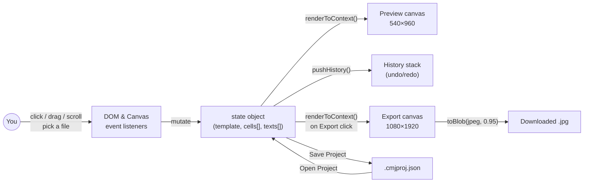
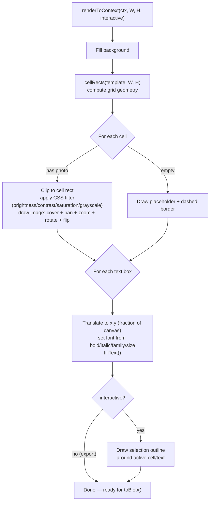
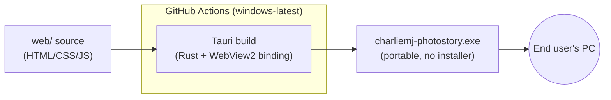

← [Back to docs index](README.md)

# Architecture

GitHub renders the diagrams below automatically since they're plain
```mermaid``` code fences — no image files to keep in sync.

## 1. Project layout

```mermaid
flowchart TB
    subgraph Repo["CharlieMJ-PhotoStory (this repo)"]
        subgraph Web["web/  — the actual app"]
            HTML["index.html"]
            CSS["style.css"]
            JS["app.js<br/>(state + render + interaction)"]
        end
        subgraph Desktop["desktop-tauri/ — native wrapper"]
            Conf["src-tauri/tauri.conf.json<br/>points at ../../web"]
            Main["src-tauri/src/main.rs<br/>opens a native window"]
        end
        subgraph CI[".github/workflows/"]
            Wf["build-windows-exe.yml<br/>runs on windows-latest"]
        end
        Docs["docs/ — this documentation"]
    end
    Desktop -- "loads" --> Web
    Wf -- "builds" --> Desktop
```

The desktop app has **no copy** of the frontend — `tauri.conf.json`'s
`frontendDist` points straight at `../../web`, so the web app and the
desktop app are always running identical code.

## 2. Runtime data flow (either app)



Note there is **no server** anywhere in this diagram — every arrow stays
inside the browser (or, for the desktop build, inside the WebView2 window).

## 3. Render pipeline (per frame)



The **same function** is used for the live preview and the final export —
only the canvas size and the `interactive` flag differ. This is the key
design decision that keeps "what you see" and "what you get" in sync.

## 4. Desktop packaging



On launch, the `.exe` opens a native window and points Windows'
built-in **WebView2** control at the local `web/` files bundled inside
the binary — the exact same HTML/CSS/JS that runs in a browser, with no
network access needed at runtime.

Continue to → [06 · Usage Guide](06-usage-guide.md)
